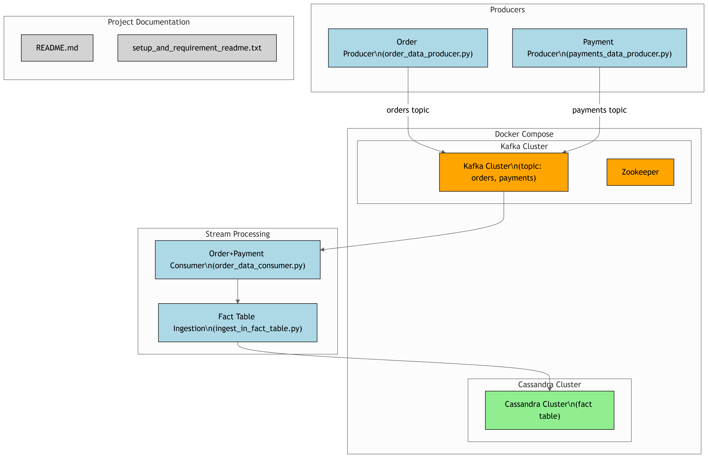

# Real-Time Order & Payment Data Ingestion Project

This project demonstrates a real-time data pipeline using **Apache Kafka** and **Apache Cassandra** for ingesting and storing order-payment transactions.

---

## 🚀 Features

- Kafka Producers to simulate order and payment events
- Kafka Consumer that joins streams from both producers
- Stores merged results into a Cassandra fact table
- Dockerized for easy setup and deployment

---

## 📊 Architecture


---

## 📦 Requirements

- Python 3.8+
- Kafka and Zookeeper running
- Cassandra instance (Docker-supported)
- Python packages:
  - `kafka-python`
  - `cassandra-driver`

Install dependencies (recommend virtualenv):

```bash
pip install kafka-python cassandra-driver


